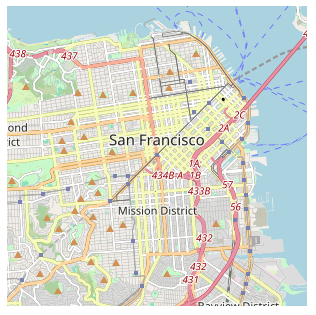

# Tiny Static Map

**Tiny Static Map** is a lightweight JavaScript library (~1 kB) that creates a static map image centered on a specified latitude and longitude. It leverages OpenStreetMap (OSM) tiles to render an arbitrarily-sized map in any container, with custom zoom levels.

### Features

- **Lightweight**: Only 1 kB in size.
- **Flexible**: Supports any output dimensions and zoom levels.
- **Center Precision**: Precisely centers the map on a specified latitude/longitude coordinate.
- **No Dependencies**: Vanilla JavaScript, no external libraries required.

---

### Example Usage

To include a static map on your webpage, create a container element, load `tiny-static-map.js`, and call `createStaticMap`:

```html
<div id="map-container"></div>
<script src="tiny-static-map.js"></script>
<script>
  const container = document.querySelector('#map-container');
  createStaticMap(container, 37.7749, -122.4194, 12, 300, 300);
</script>
```

This example centers a 300x300 pixel map on San Francisco (latitude 37.7749, longitude -122.4194) at zoom level 12, producing a map that looks like this:



---

### Function Reference

#### `createStaticMap(container, lat, lon, zoom, width, height)`

Generates a static map centered on a given coordinate, with specified dimensions and zoom level.

- **Parameters**:
  - `container` (HTMLElement): The HTML element to contain the map (e.g., `document.getElementById('map-container')`).
  - `lat` (number): Latitude for the center point of the map.
  - `lon` (number): Longitude for the center point of the map.
  - `zoom` (number): Zoom level for the map. Higher values (e.g., 15-18) show more detail; lower values (e.g., 5-10) show a larger area.
  - `width` (number): Width of the map in pixels.
  - `height` (number): Height of the map in pixels.

- **Returns**: None. The function directly manipulates the DOM to create a tiled map inside the specified container.

---

### Tile Attribution

When using this library, remember to credit [OpenStreetMap contributors](https://www.openstreetmap.org/copyright).

